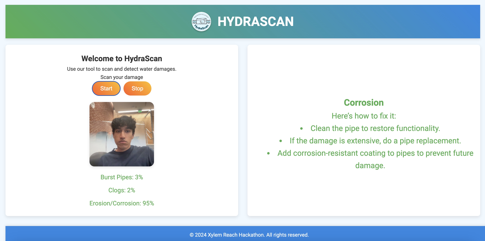

# xylem-reach

# What It Does ℹ️

HydraScan allows users to scan their water damage straight from their phone, and allows for connection to CCTV footage for remote use!

# Example 📸

Here is a screenshot of our project!

# Collaborators 👨‍💻

- [Vedika Singh](https://github.com/vedikasinghhh)
- [Annie Nguyen](https://github.com/annienguyen740)
- [Suhaani Gupta](https://github.com/suhaanig14)
- [Shrey Agarwal](https://github.com/agshrey)
